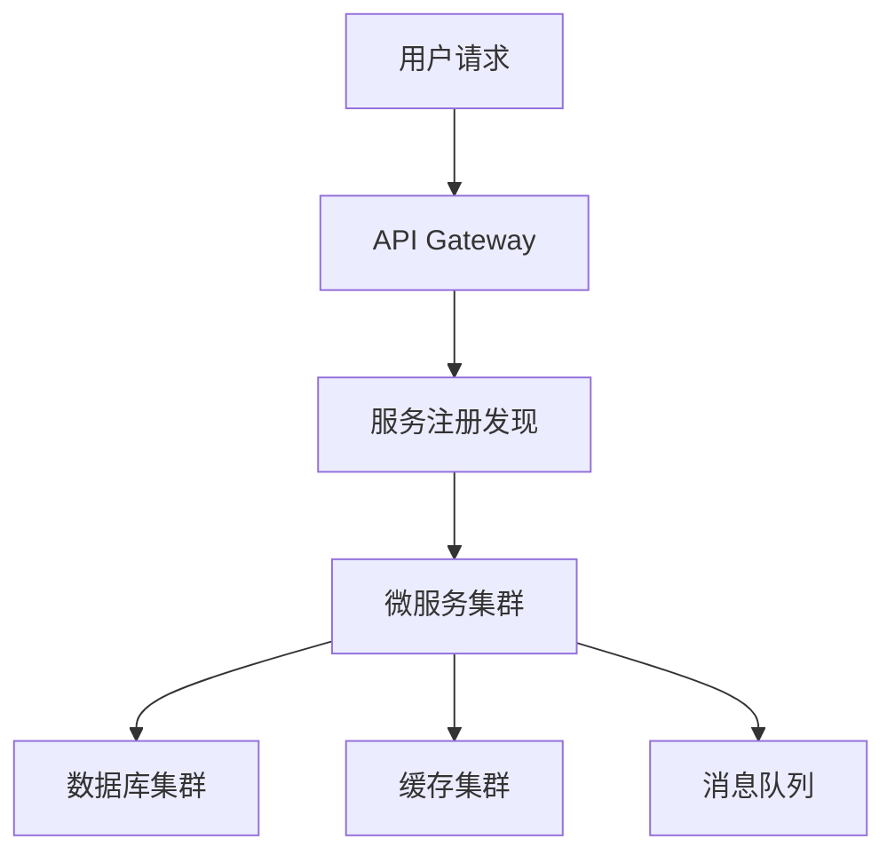

# 架构模式速查

| 场景 | 推荐架构 | 关键技术 |
| :--- | :--- | :--- |
| 高并发交易 | 微服务 + 事件驱动 | Kubernetes, Kafka, Redis |
| 大数据处理 | Lambda 架构 | Spark, Flink, S3 |
| 多租户 SaaS | 多租户 + 模块化 | PostgreSQL schemas, API Gateway |
| 实时系统 | 事件溯源 + CQRS | Event Store, gRPC |

## 最小示例



## ADR 模板

```md
# ADR-<编号>: <标题>
- 日期：YYYY-MM-DD
- 状态：提议 / 已接受 / 已废弃
- 背景：<问题与约束>
- 决策：<选择了什么>
- 理由：<四步法分析>
- 备选方案：<列表 + 否决理由>
- 后果：<正面 / 负面 / 风险>
- 相关：<PRD / 关联 ADR>
```

## 误区

- 过度设计 / 追新 → 务实、成熟稳定优先
- 忽视 NFR → 性能/安全/可扩展作为核心设计目标
- 单点设计不考虑演进 → 预留扩展空间
